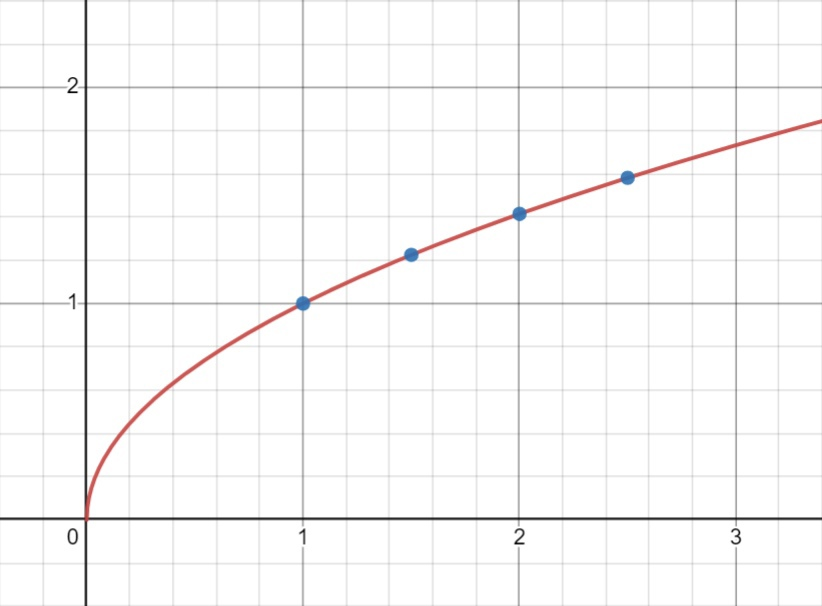

ЛР №5. Интерполяция методом Лагранжа
====================================

Теория
------

Формула Лагранжа, интерполяционный многочлен
~~~~~~~~~~~~~~~~~~~~~~~~~~~~~~~~~~~~~~~~~~~~

| Формула интерполяционного многочлена Лагранжа:
| :math:`P_{n}(x_{j})=\sum_{i=0}^{n}y_{i}\cdot q_{i}(x_{j})`
| где :math:`q_{i}(x) = \frac{(x-x_{0})(x-x_{1})...(x-x_{i-1})(x-x_{i+1})...(x-x_{n})}{(x_{i}-x_{0})(x_{i}-x_{1})...(x_{i}-x_{i-1})(x_{i}-x_{i+1})...(x_{i}-x_{n})}`

Частные случаи интерполяционного многочлена Лагранжа
~~~~~~~~~~~~~~~~~~~~~~~~~~~~~~~~~~~~~~~~~~~~~~~~~~~~

| При :math:`n = 1` (интерполяция по двум имеющимся точкам) формула примет вид:
| :math:`p_{1}(x)=y_{0}\cdot \frac{x-x_{1}}{x_{0}-x_{1}}+y_{1}\cdot \frac{x-x_{0}}{x_{1}-x_{0}}`

| При :math:`n = 2` (интерполяция по трём имеющимся точкам) формула примет вид:
| :math:`p_{2}(x)=y_{0}\cdot \frac{(x-x_{1})(x-x_{2})}{(x_{0}-x_{1})(x_{0}-x_{2})}+y_{1}\cdot \frac{(x-x_{0})(x-x_{2})}{(x_{1}-x_{0})(x_{1}-x_{2})}+y_{2}\cdot \frac{(x-x_{0})(x-x_{1})}{(x_{2}-x_{0})(x_{2}-x_{1})}`

| При :math:`n = 3` (интерполяция по четырём имеющимся точкам) формула примет вид:
| :math:`p_{2}(x)=y_{0}\cdot \frac{(x-x_{1})(x-x_{2})(x-x_{3})}{(x_{0}-x_{1})(x_{0}-x_{2})(x_{0}-x_{3})}+y_{1}\cdot \frac{(x-x_{0})(x-x_{2})(x-x_{3})}{(x_{1}-x_{0})(x_{1}-x_{2})(x_{1}-x_{3})}+y_{2}\cdot \frac{(x-x_{0})(x-x_{1})(x-x_{3})}{(x_{2}-x_{0})(x_{2}-x_{1})(x_{2}-x_{3})}+`
| :math:`+y_{3}\cdot \frac{(x-x_{0})(x-x_{1})(x-x_{2})}{(x_{3}-x_{0})(x_{3}-x_{1})(x_{3}-x_{2})}`

Оценка погрешности
~~~~~~~~~~~~~~~~~~

| :math:`\varepsilon_{\text{реальное}}=\varepsilon_{\text{округления}}+\varepsilon_{\text{усечения}}`
|
| :math:`\varepsilon_{\text{округления}}` - это то значение до которого мы округляли. **Например:** если мы округляем до 4-х знаков, то погрешность будет :math:`5\cdot 10^{-5}`
|
| :math:`\varepsilon_{\text{усечения}} \le \frac{M_{n+1}}{(n+1)!}\cdot ((x-x_{0})...(x-x_{n}))`
| где :math:`M_{n+1}=max(f^{(n+1)}(x))`

Задание на лабораторную работу
------------------------------

| Реализуйте программу, позволяющую примерно вычислить значение функции в точке. Функция задаётся в виде соответствий :math:`x\;y(x)`. Соответствия берутся из файла.
| Для получения оценки выше 3 необходимо реализовать вывод графиков:
| 1. График функции, получившийся путем интерполяции многочленом Лагранжа;
| 2. Точки, считанные из файла;
| Если известно уравнение функции, то её график.

Пример работы
-------------

| Содержимое входного файла *input.txt*:
|   1 1
|   1.5 1.22474
|   2 1.41421
|   2.5 1.58114
|
| Как можно заметить, точки соответствуют графику функции :math:`y(x)=\sqrt{x}`.
| Попросим подсчитать значение в точке *1,69*.
| Ответ, который должна выдать программа: *1,30020359276*. Допусакаются ответы в пределах погрешности.
|
| Пример графика:

